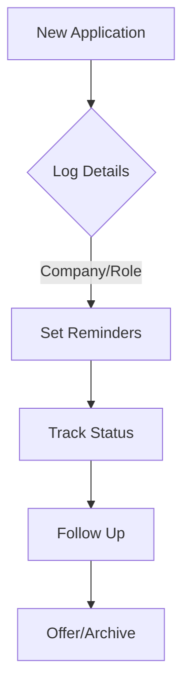

## Overview

ResumeUp.AI equips you with powerful tools to build standout resumes, optimize your online presence, track applications, and prepare for interviews. You start with AI-driven resume creation and progress through a complete job search workflow. Each feature integrates seamlessly to boost your success rate.

<Callout kind="info">
Focus on one feature at a time to maximize your results. Begin with the AI resume builder for immediate impact.
</Callout>

## Key Features at a Glance

Discover the core capabilities that make ResumeUp.AI your all-in-one career companion.

<Columns cols={3}>
  <Card title="AI Resume Builder" icon="zap" href="#ai-resume-builder">
    Generate tailored resumes in minutes using AI that analyzes your experience and job descriptions.
  </Card>
  <Card title="ATS Score Checker" icon="check-circle" href="#ats-scoring">
    Scan your resume for ATS compatibility and get instant optimization suggestions.
  </Card>
  <Card title="LinkedIn Optimizer" icon="users" href="#linkedin-optimizer">
    Enhance your profile with AI recommendations to attract recruiters.
  </Card>
  <Card title="Job Tracker" icon="trending-up" href="#job-tracker">
    Organize applications, deadlines, and follow-ups in a centralized dashboard.
  </Card>
  <Card title="Interview Prep" icon="play-circle" href="#interview-prep">
    Access mock interviews, question banks, and personalized feedback tools.
  </Card>
</Columns>

## AI Resume Builder Workflow

Follow these steps to create a professional resume powered by AI.

<Steps>
  <Step title="Input Your Details" icon="user">
    Enter your work history, skills, and target job title. Upload existing resumes or start from scratch.

    ```
    Example input structure:
    - Name: John Doe
    - Experience: Software Engineer at TechCorp (2020-2024)
    - Skills: React, Node.js, AWS
    ```
  </Step>
  <Step title="Generate with AI" icon="zap">
    Paste a job description and let AI tailor your content.

    <CodeGroup tabs="Web,API">
      ```javascript
      // Web interface simulation
      const jobDesc = "Senior React Developer...";
      generateResume({ experience: userData, job: jobDesc });
      ```
      ```bash
      # API call example
      curl -X POST https://api.example.com/resumes \
        -H "Authorization: Bearer YOUR_API_KEY" \
        -d '{"jobDescription": "Senior Developer..."}'
      ```
    </CodeGroup>
  </Step>
  <Step title="Select Template" icon="book-open">
    Choose from 20+ ATS-friendly templates like Catalyst or Craft.
  </Step>
  <Step title="Export and Apply" icon="download">
    Download as PDF or share directly to job sites.
  </Step>
</Steps>

## ATS Compatibility Scoring

Ensure your resume passes applicant tracking systems used by 95% of Fortune 500 companies.

<Tabs>
  <Tab title="Before Optimization" icon="alert-triangle">
    Upload your draft and receive a score out of 100.

    | Issue Type     | Common Fixes                  |
    |----------------|-------------------------------|
    | Keywords       | Add job-specific terms       |
    | Formatting     | Use standard headings         |
    | Length         | Keep under 2 pages            |
  </Tab>
  <Tab title="After Optimization" icon="check-circle">
    Optimized resumes average 95+ scores. Re-scan after edits.

    <Callout kind="tip">
    Target `<90%` scores? Prioritize keyword matching from the job description.
    </Callout>
  </Tab>
</Tabs>

## LinkedIn Profile Optimization

Sync your resume data to supercharge your LinkedIn presence.

<Expandable title="Optimization Steps" default-open="true">
  1. Connect your LinkedIn account.
  2. AI suggests headline, summary, and experience updates.
  3. Preview changes before applying.

  ```javascript
  // Example LinkedIn headline generator
  const optimizedHeadline = aiGenerateHeadline({
    currentRole: "Software Engineer",
    target: "Senior Developer"
  });
  // Output: "Senior Software Engineer | React Expert | AWS Certified"
  ```
</Expandable>

## Job Application Tracking

Stay organized with the built-in tracker.



Use custom fields like interview dates and notes. Export reports for review.

## Interview Preparation Resources

Prepare confidently with AI-generated mock interviews and question libraries tailored to your role.

<Columns cols={2}>
  <Card title="Mock Interviews" icon="mic" href="#">
    Practice with AI interviewer feedback.
  </Card>
  <Card title="Question Bank" icon="book" href="#">
    1,000+ role-specific questions.
  </Card>
</Columns>

<Callout kind="success">
Ready to get started? Build your first resume using the workflow above, then optimize for ATS.
</Callout>